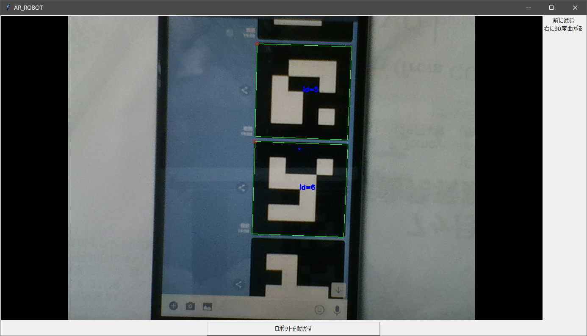

# AR_robocon
[](https://www.youtube.com/watch?v=eOPjWRmBqwg)

## OverView
ARマーカーを読み込んでロボットが動きます。

## Description
ARマーカーを含む画像を撮影するとその画像の中からARマーカーを探します。
見つけたら上から順に読み込みARマーカーのIDの内容に従ってArduinoにシリアル通信をします。

Arduino側プログラムは受け取ったコマンドを解釈してそのとおりに動きます。


## 必要なもの
- Python 3.6 (一部プログラム修正で3.5以下でも動作可能)
- opencv-python( 環境によっては opencv-contrib-pythonも必要)
- pyserial
- numpy
- Pillow

## 動かし方
最初に

```
python AR_Reader.py Generator
```

でARマーカーを作成してください。

```
python Window.py
```
メインファイルです。実行すると新規ウインドウが立ち上がります。



ロボットを動かすボタンを押すと認識したARマーカーをシリアルポートに送信します。

```
python AR_Reader.py Reader
```

でARマーカー読み込み
キャプチャ画像がメインウインドウになっている状態で"A"を入力すると、
その時点での画像が"out.png"に保存されます。同時にTakeAR.pyが呼び出されArduinoが動き出します。

```
python TakeAR.py
```

を実行すると"Test.png"が呼ばれます。これはカメラがなくても実行可能です。

## 注意点
現状、使っているIDが殆どありません。

各自、TakeAR.pyの18行目～及びArduinoファイルに書き込んでください。

## バグなど

- ARマーカーの認識順序が不安定です。
- COMポートの変更は実行ファイルに直接書き込みする必要があります。
